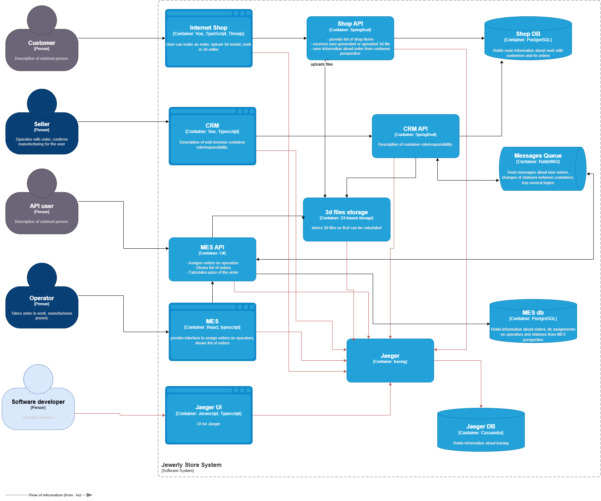

# Архитектурное решение по трейсингу

## Список данных, которые должны попадать в трейсинг
Для обеспечения эффективной трассировки, необходимо собирать следующие данные:
- **Уникальный идентификатор запроса (Trace ID):** Глобальный идентификатор, присваиваемый каждому запросу.
- **Идентификатор этапа (Span ID):** Идентификатор для каждого этапа обработки запроса, например, отправка/чтение сообщений из RabbitMQ, запросы к базе данных.
- **Теги:** Дополнительные атрибуты, расширяющие контекст запроса:
  - order_id: Идентификатор заказа.
  - user_type: Тип пользователя (B2C или B2B).
  - service_name: Имя сервиса (Shop API, CRM API, MES API).
  - queue_name: Имя очереди (для RabbitMQ).
  - error_code или exception_type: Код ошибки или тип исключения (при возникновении ошибок).

## Мотивация
В текущей архитектуре отсутствие системы трассировки (Tracing) существенно затрудняет диагностику ошибок и выявление 
причин задержек в работе приложений в производственной среде. Сложности возникают при:
- Локализации причин ошибок, возникающих в бизнес-процессах.
- Анализе производительности и выявлении “узких мест” в работе системы.
- Оптимизации времени обработки запросов.
Внедрение системы трассировки (Tracing) позволит:
- Отслеживать полный путь запроса от клиента до получения ответа, включая взаимодействие между компонентами системы.
- Выявлять текущие и потенциальные проблемы в работе системы, связанные с производительностью, функциональностью и 
интеграцией между сервисами.
- Сократить время, необходимое для устранения неисправностей и повышения качества обслуживания пользователей.

## Предлагаемое решение

[Диаграмма контейнеров Task3.drawio](./Task3.drawio)

### Технологический стек
Предлагается использовать следующий технологический стек:
- **Jaeger:** Система для сбора, хранения и визуализации данных трассировки.
- **Cassandra:** База данных для хранения данных трассировки.
- **Jaeger UI:** Пользовательский интерфейс для просмотра и анализа данных трассировки.
- **OpenTelemetry библиотеки:** Библиотеки для автоматического внедрения трассировки в микросервисы 
(Shop API, CRM API, MES API). OpenTelemetry будет автоматически формировать трассы, спаны и отправлять данные в Jaeger.
- **Интеграция с JDBC (Entity Framework):** Для автоматического отслеживания выполнения запросов к базам данных.
- **Интеграция с фронтендом:** Использование браузерных плагинов OpenTelemetry для сбора данных трассировки с клиентских
приложений (Vue (Shop, CRM) и React (MES)). Это позволит отслеживать путь запроса, начиная с момента взаимодействия 
пользователя с интерфейсом (например, нажатия кнопки “Оформить заказ”).

## Компромиссы
Внедрение системы трассировки предполагает:
- **Дополнительные затраты ресурсов и сложности:** Требуется настройка приложений (фронтенд и бэкенд) для передачи 
данных трассировки.
- **Необходимость маскирования данных:** Реализация механизмов маскирования конфиденциальных данных в рамках логирования 
и трассировки.
- **Возможное приобретение платных инструментов:** Ряд систем трассировки с расширенным функционалом могут быть 
коммерческими решениями.

## Безопасность
Для обеспечения безопасности данных необходимо:
- **Контроль доступа:** Реализовать систему аутентификации и авторизации для доступа к данным трассировки, обеспечив 
доступ только авторизованным пользователям (разработчикам и бизнес-администраторам).
- **Маскирование данных:** Настроить систему трассировки для исключения попадания конфиденциальных и персональных данных 
в логи и трассировки.
- **Защита доступа:** Ограничить доступ к системе трассировки только из внутреннего контура системы, используя, 
например, VPN для доступа.