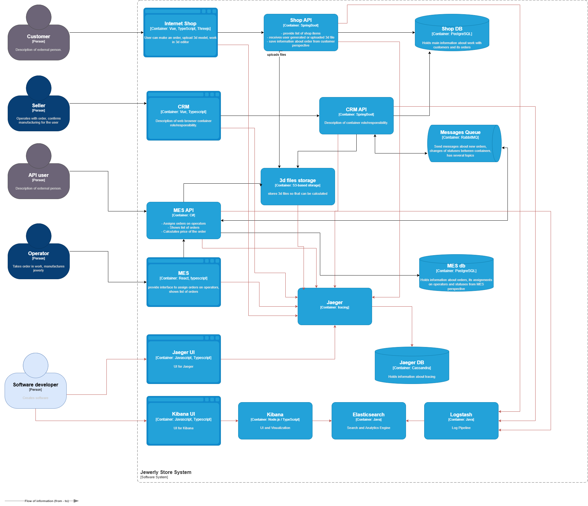

# Архитектурное решение по логированию

## Описание сбора логов и их источников  

Всего есть 6 уровней логирования TRACE, DEBUG, INFO, WARN, ERROR и FATAL.
- **TRACE, DEBUG:** Наиболее детализированные уровни, предназначенные для отладки приложений и анализа хода выполнения операций
- **INFO:** Информационные сообщения об успешном выполнении операций (например, вход пользователя в систему, загрузка файла, 
изменение статуса заказа, успешная оплата).
- **WARN:** Предупреждения о потенциальных проблемах, которые пока не являются критичными (например, неудачная попытка 
входа в систему).
- **ERROR:** Сообщения о серьезных ошибках, приводящих к частичной или полной неработоспособности сервисов (например, 
ошибки базы данных, ошибки внешних API, ошибки в логике сервиса).
- **FATAL:** Сообщения о критических ошибках, приводящих к полной неработоспособности приложения 
(например, OOM Error - нехватка памяти).

## Мотивация
Эффективное логирование является критически важным элементом для мониторинга, диагностики и анализа работы 
информационных систем. Централизованная система логирования позволит:
- Оперативно отслеживать состояние приложений и выявлять возникающие проблемы.
- Проводить детальное расследование инцидентов и определять причины сбоев.
- Настраивать систему оповещений (алертинг) для быстрого реагирования на критические ошибки.
- Оптимизировать производительность системы путем анализа логов.

Внедрение централизованной системы логирования позволит повысить стабильность, надежность и безопасность ИТ-инфраструктуры.

Внедрение системы логирования окажет положительное влияние на следующие бизнес-показатели:
- **Количество ошибок:** Снижение количества ошибок за счет оперативного выявления и устранения проблем.
- **Скорость выявления и исправления ошибок (SLA):** Сокращение времени, необходимого для выявления и исправления ошибок.
- **Удовлетворенность клиентов:** Повышение удовлетворенности клиентов за счет стабильной работы сервисов.
- **Процент потерянных заказов:** Снижение процента потерянных заказов за счет оперативного устранения ошибок.
- **Нетипичное поведение системы (безопасность):** Выявление нетипичного поведения системы, указывающего на возможные 
угрозы безопасности.
- **Расчет скорости исполнения кода в приложении:** Анализ времени выполнения кода для выявления “узких мест” и 
оптимизации производительности.

Учитывая текущую архитектуру и нагрузку на сервисы, логирование будет внедряться поэтапно. В первую очередь необходимо 
настроить логирование в сервисе MES, т.к. это самый нагруженный сервис в системе, где ошибки могут привести к 
значительным финансовым потерям и срыву производственных планов. Далее следует настроить логирование в CRM системе т.к. 
с ней активно работают менеджеры и логирование поможет им оперативно реагировать на проблемы в работе системы, а также 
логирование потребуется для аудита действий пользователей в CRM. Остальные части системы, также в порядке приоритета, 
учитывая их критичность и влияние на бизнес-процессы.

## Предлагаемое решение
[Диаграмма контейнеров Task4.drawio](./Task4.drawio)

Для реализации централизованной системы логирования рекомендуется использовать ELK Stack (Elasticsearch, Logstash, Kibana):
- **Logstash:** Компонент для сбора, обработки и передачи логов с серверов и контейнеров.
- **Elasticsearch:** Централизованное хранилище логов.
- **Kibana:** Пользовательский интерфейс для поиска, анализа и визуализации логов.

Политика хранения логов и безопасности:
- **Маскирование конфиденциальных данных:** Необходимо реализовать маскирование конфиденциальных и персональных данных 
в логах для соблюдения требований безопасности и защиты персональных данных.
- **Длительное хранение логов аудита:** Логи аудита (например, записи о входе пользователей в систему, оплате заказов)
Примерный срок хранения пол года - год.
- **Контроль доступа к логам:** Доступ к логам должен быть ограничен только зарегистрированными разработчиками и 
администраторами системы.

Для эффективной организации и поиска логов рекомендуется использовать отдельные индексы для каждой системы:
- `mes-logs-%{YYYY.MM.dd}`
- `crm-logs-%{YYYY.MM.dd}`
- `shop-logs-%{YYYY.MM.dd}`
- `rabbitmq-logs-%{YYYY.MM.dd}`
- `audit-logs-%{YYYY.MM.dd}` - аудит логи с расширенным сроком хранения

Для автоматического удаления устаревших данных рекомендуется использовать Index Lifecycle Management (ILM) в Elasticsearch.

## Алертинг
Необходимо настроить систему оповещений (алертинг) с использованием Kibana Alerting для оперативного реагирования на 
следующие события:
- Фатальные ошибки (FATAL).
- Ошибки (ERROR).
- Частые падения/перезапуски сервисов.
- Частые неудачные попытки входа в систему.
- Резкое повышение количества запросов/загруженности сервисов.