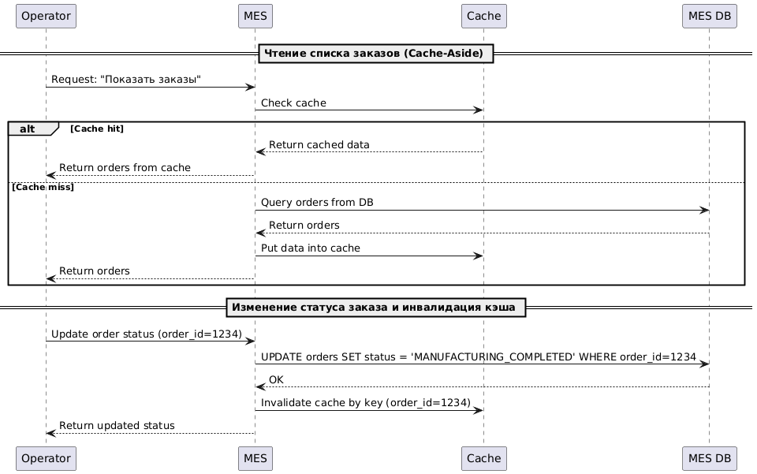

# Архитектурное решение по кешированию

## Анализ системы, где можно применить кеширование
Анализ текущей системы выявил, что MES-приложение является наиболее нагруженным компонентом. 
Операторы часто просматривают страницу заказов, что приводит к высокой нагрузке на базу данных и увеличению времени 
отклика приложения.

## Мотивация
Внедрение кэширования в текущий проект позволит:
- Увеличить скорость отображения страницы заказов для операторов.
- Снизить нагрузку на базу данных.
- Улучшить пользовательский опыт работы с приложением.
- Повысить общую производительность системы.

Данные изменения благотворительно скажутся на клиентском опыте, то не только понравиться нынешним пользователям, 
но и привлечёт новых.

Предлагается кэшировать следующие объекты в MES-приложении:
- Страницу заказов (список заказов).
- Отдельные заказы (детализированная информация о заказе).
- Результаты расчета стоимости заказа.

## Предлагаемое решение
Предлагается рассмотреть следующие варианты кэширования:
- **Клиентское кэширование:** Кэширование данных на стороне клиента (в браузере). Подходит для статических данных, 
которые не часто меняются. Однако, в случае MES-приложения, клиентское кэширование не даст существенного выигрыша, 
т.к. операторы постоянно обновляют список заказов и статусы заказов меняются динамически.
- **Серверное кэширование:** Кэширование данных на стороне сервера. Это более гибкое решение, которое дает больший 
контроль над данными. Можно централизованно решать, что и как кэшировать и когда инвалидировать кэш.

В данном случае, учитывая динамичность данных и необходимость централизованного управления, предпочтительным является серверное кэширование.

В MES-приложении преобладают операции чтения, поэтому для серверного кэширования можно рассмотреть следующие паттерны:
- **Cache-Aside:** При запросе данных приложение сначала проверяет наличие данных в кэше. Если данные найдены 
(cache hit), они возвращаются из кэша. Если данные не найдены (cache miss), приложение запрашивает данные из базы 
данных, сохраняет их в кэше и возвращает клиенту.
- **Write-Through:** При записи данных приложение сначала записывает данные в кэш, а затем в базу данных. Этот паттерн 
не подходит для MES-приложения, т.к. не факт, что только что созданный заказ будет сразу взят в работу.
- **Refresh-Ahead:** При запросе данных приложение проверяет срок действия данных в кэше. Если срок действия истекает, 
приложение асинхронно обновляет данные в кэше. Этот паттерн требует прогнозирования данных, которые будут запрошены, 
и не позволяет эффективно обновлять устаревшие заказы. Также, имеет более сложную реализацию.

Учитывая простоту реализации и гибкость управления кэшированием, наиболее подходящим паттерном является Cache-Aside.

[Task5.puml](./Task5.puml)

### Стратегия инвалидации кеша
Для обеспечения актуальности данных в кэше необходимо использовать стратегию инвалидации кэша. 
Предлагается использовать смешанную стратегию инвалидации:
- **Инвалидация по ключу:** При просмотре подробностей заказа или расчете стоимости заказа кэш инвалидируется по ключу (идентификатору заказа). Этот способ обеспечивает немедленное обновление данных при изменении статуса заказа.
- **TTL-инвалидация (Time-To-Live):** Для списка последних заказов используется инвалидация по времени (например, 10-60 секунд). Это позволяет обеспечить актуальность списка заказов, при этом минимизируя нагрузку на базу данных.

| Способ инвалидации кеша             | Описание                                                                                    |
|-------------------------------------|---------------------------------------------------------------------------------------------|
| Временная инвалидация               | Данные имеют определённый срок действия (TTL). После истечения времени кэш сбрасывается     |
| Инвалидация, основанная на запросах | Обеспечивает актуальность данных в зависимости от активности пользователей.                 | 
| Инвалидация на основе изменений     | Кэш сбрасывается сразу после изменения данных, чтобы отразить состояние в реальном времени. |
| Программная инвалидация             | Позволяет гибко управлять инвалидацией кеша в соответствии с логикой приложения             |
| Инвалидация по ключу                | Позволяет точно определять, ключи нужно сбросить или обновить.                              | 
